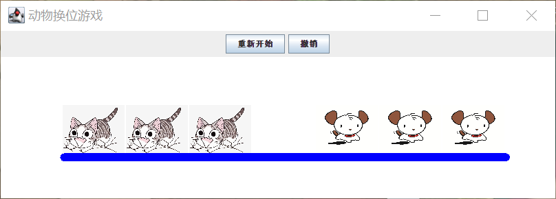
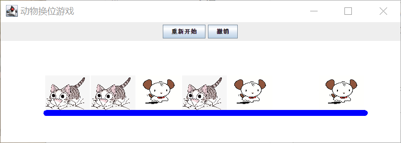

# 测试文档：

## **一、代码测试**

按照源文件中的包语句相关的Java源文件保存到以下目录中：

**一次编译全部源文件：**

D:\ >javac/ch1/data/*.java

把给出的类看作一个小框架，下面用框架中的类编写一个简单的应用程序，测试左、右动物运动换位，即在命令行表述对象的行为过程，如果表述成功（如果表述困难，说明数据模型不是很合理），那么就为以后的GUI程序设计提供了很好的对象功能测试，在后续的GUI设计中，重要的工作仅仅是为某些对象提供视图界面，并处理相应的界面事件而已。

将AppTest.java源文件按照包名保存到以下目录中：

D:\ch1\test

编译源文件：D:\javac ch1/test/AppTest.java

**运行AppTest类，运行结果如图所示【图片名：测试图片】**

## **二、APP测试：**

### **1、课本代码实现的基本功能版本的app测试：**

#### 1）测试步骤：

**打开命令窗口，输入：java -jar animalGame.jar**

得到如下图【图片名：程序测试步骤1】

回车得到app视图如图所示：【图片名：程序界面】

#### 2）游戏功能测试：

游戏基本功能测试：【图片名：游戏基本功能】

### **2、完成所有功能版本的app测试：**

#### 1）测试步骤：

**打开命令窗口，输入：java -jar jarcs.jar**

得到如下图：【图片名：测试操作】

回车得到app视图如图所示：【图片名：App视图】

#### 2）游戏功能测试：

游戏功能如图所示【图片名：游戏功能】基本游戏功能实现。

难易级别选择功能的实现：【图片名：级别选择功能】

小猫小狗图片可自行选择功能如下图所示：【图片名：图片选择功能】

英雄榜排行功能：【图片名】

计时功能如下：【图片名：计时功能】

